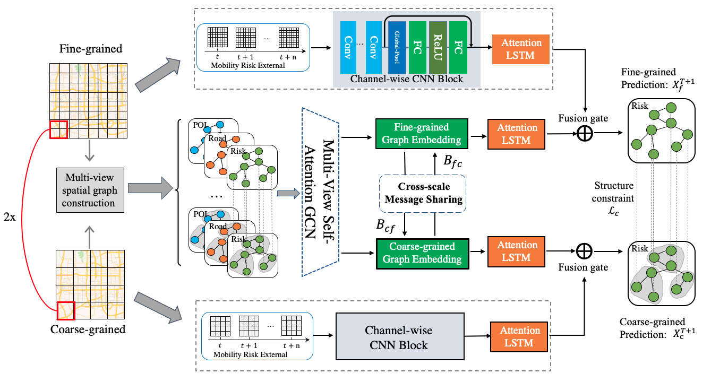

# Contents

- [Contents](#contents)
    - [MVMT-STN Description](#MVMT-STN-description)
    - [MVMT-STN architecture](#MVMT-STN-architecture)
    - [Dataset](#dataset)
    - [Script description](#script-description)
    - [Description of Random Situation](#description-of-random-situation)

# [MVMT-STN Description](#contents)

In this paper, we proposed a novel Multi-View Multi-Task Spatio-Temporal Network model named MVMT-STN to more effectively predict fine- and coarse-grained citywide traffic accident risks simultaneously. Particularly, we adapted a multi-task learning framework to jointly forecast fine- and coarse-grained traffic accident risks to alleviate the data sparsity issue. A cross-scale GCN and a structure constraint loss were also designed to effectively couple the two prediction tasks over two data granularities. For each granularity, we proposed a channel-wise CNN and a multi-view GCN to capture both the local geographic and global semantic dependencies. In order to obtain the diverse impacts of the external context features on traffic accidents, we also proposed a feature fusion module which enabled weighted multi-channel fusion and cross-view information sharing. 

[Paper](https://ieeexplore.ieee.org/document/9652050): Senzhang Wang; Jiaqiang Zhang; Jiyue Li; Hao Miao; Jiannong Cao. Traffic Accident Risk Prediction via Multi-View Multi-Task Spatio-Temporal Networks. TKDE 2022.

## [MVMT-STN architecture](#contents)

An illustration of the proposed MVMT-STN model.


## [Dataset](#contents)

Dataset used: 
- [NYC] Dataset size: Accidents:147k; Taxi Trips:173,179k; POIs:15,625; Weathers:8,760; Road Network:103k

- [Chicago] Dataset size: Accidents:44k; Taxi Trips:1744k; Weathers:5832; Road Network:56k

- Data format：npz
    - Note：Data can be downloaded in https://data.cityofnewyork.us/Public-Safety/NYPD-Motor-Vehicle-Collisions/h9gi-nx95 ;
        https://data.cityofnewyork.us/City-Government/road/svwp-sbcd


## [Script description](#contents)

```python
├── MVMT-STN
  ├── Readme.md     # descriptions about MVMT-STN   
  ├── src
  │   ├──utils.py      # Tools used in the design model
  │   ├──dataloader.py     # creating dataset
  │   ├──metrics.py      # Indicators for model training and evaluation
  ├── model
      ├──model.py   # The model about MVMT-STN  
```

## [Description of Random Situation](#contents)

We use random seed in the model.

## [ModelZoo Homepage](#contents)

Please check the official [homepage](https://gitee.com/mindspore/models).